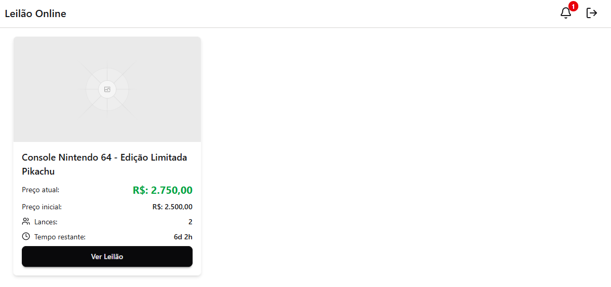
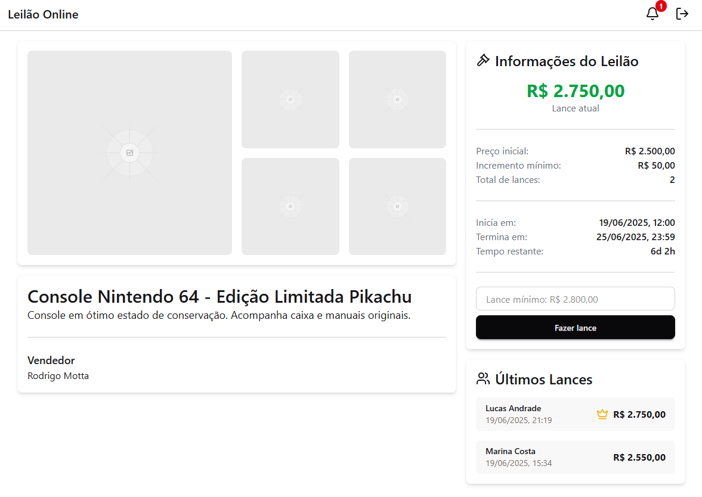

> ⚠️ Este projeto está em desenvolvimento. ⚠️

# 🏷️ Sistema de Leilão

### 🚀 Visão Geral

Este projeto é um laboratório prático onde pude consolidar e demonstrar minhas habilidades no desenvolvimento de sistemas distribuídos.

### 🔧 Tecnologias Utilizadas

**Backend**

- **Java 21**
- **Spring Boot** – Framework para desenvolvimento dos microserviços
- **Spring Security + OAuth2 Resource Server** – Autenticação/autorização baseada em JWT
- **Spring Cloud Gateway** – Gateway para roteamento
- **PostgreSQL** – Banco de dados relacional
- **RabbitMQ** – Mensageria para comunicação assíncrona entre microserviços
- **Keycloak** – Provedor de identidade e autorização
- **Zipkin** – Rastreamento distribuído
- **Prometheus + Micrometer** – Coleta e exposição de métricas

**Frontend**

- **Javascript**
- **React**
- **Tailwind**
- **DaisyUI**
- **Axios**

### 📸 Imagens da interface do usuario

