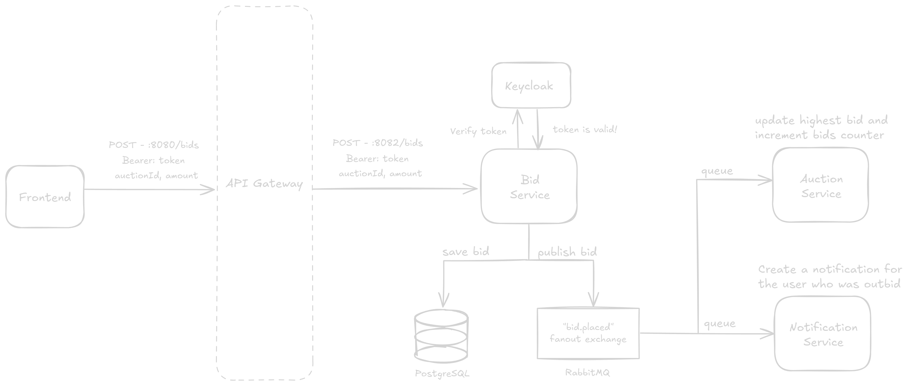
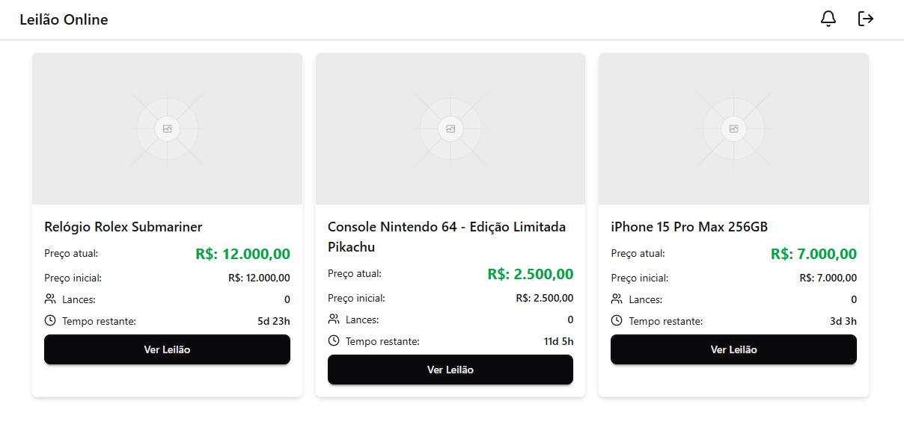
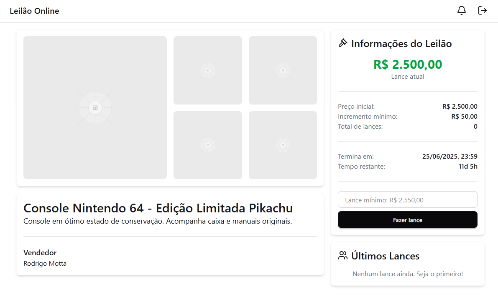
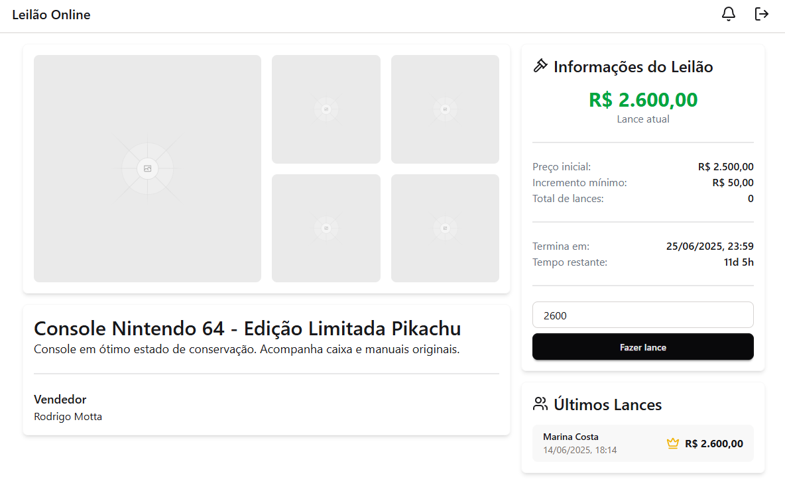
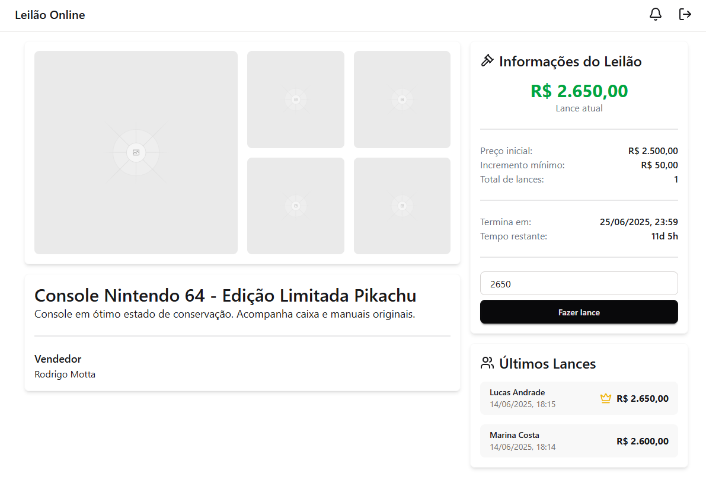
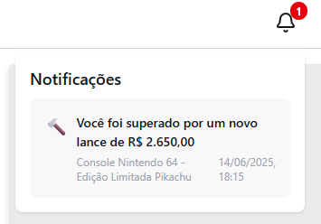

# Sistema de Leilão - Arquitetura de Microserviços

> ⚠️ Este projeto está em desenvolvimento.

## 🚀 Visão Geral

Este projeto é um laboratório prático onde pude consolidar e demonstrar minhas habilidades no desenvolvimento de
sistemas distribuídos.

## 🔧 Componentes

- **Frontend**: Interface web que se comunica com o API Gateway e recebe atualizações em tempo real via WebSocket.
- **API Gateway**: Roteador central de requisições HTTP, responsável também pela validação de tokens de autenticação.
- **Auth-Service**: Responsável por intermediar a comunicação com o Keycloak, gerando e validando tokens de acesso e atualização.
- **Auction-Service**: Serviço de gerenciamento de leilões (criação, listagem e atualização do lance atual via mensageria).
- **Bid-Service**: Valida, registra e propaga lances por WebSocket e RabbitMQ.
- **Notification-Service**: Gera e armazena notificações para usuários que foram superados em um leilão.

## Fluxo do lance

## 🔐 Fluxo de Autenticação (Authorization Code Flow)

1. O usuário clica em "Entrar" na interface web, sendo redirecionado para a tela de login do Keycloak.
2. Após autenticação, o Keycloak redireciona de volta ao frontend com um `authorization_code`.
3. O frontend troca esse código por um par de tokens (`access_token` e `refresh_token`) diretamente com o Keycloak.
4. O `access_token` (JWT) é armazenado e enviado no cabeçalho (`Authorization: Bearer`) das requisições que requerem autenticação.
5. Quando o `access_token` expira, o `refresh_token` é utilizado para obter um novo par de tokens sem necessidade de novo login.
6. O API Gateway valida os tokens em cada requisição, garantindo o acesso apenas a usuários autenticados.

## 📸 Imagens da interface do usuario

## 📦 Tecnologias Utilizadas

- **Java** + **Spring Boot**
- **PostgreSQL**
- **JavaScript** + **React**
- **RabbitMQ**
- **WebSocket** (atualizações em tempo real)
- **Keycloak** + OpenID Connect
- **Spring Cloud Gateway**
- **Docker** + **Docker Compose**

## 🧪 Em desenvolvimento
- **Trace Distribuído**
- **Logs Centralizados**
- **Métricas e Monitoramento**
- **Retry, Timeout e Circuit Breaker**
- **Escopos e Roles por Recurso**
- **Documentação com Swagger/OpenAPI**
- **Dead Letter Queue**
